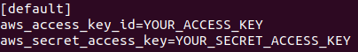

# Supplementary Resources
- Create Amazon EFS: https://docs.ray.io/en/latest/cluster/cloud.html#using-amazon-efs
    - https://aws.amazon.com/getting-started/hands-on/create-mount-amazon-efs-file-system-on-amazon-ec2-using-launch-wizard/?trk=gs_card
- Use Ray Cluster Launcher: https://docs.ray.io/en/latest/cluster/launcher.html#using-the-ray-cluster-launcher
- See AWS/Cloud Cluster Guide: https://docs.ray.io/en/latest/cluster/cloud.html#launching-cloud-clusters
- See AWS config example: https://github.com/ray-project/ray/blob/master/python/ray/autoscaler/aws/example-full.yaml

# Preliminary Setup:
- Before starting the following instructions you should already have setup your AWS account and switched to the right region etc.
- Here is some instructions on how to setup groups and users: https://docs.aws.amazon.com/IAM/latest/UserGuide/getting-started_create-admin-group.html
- In addition you should have a python script which uses Ray that will be deployed on the cluster.
    - Ray Documentation: https://docs.ray.io/en/latest/
    - Ray Tutorials (see ray-crash-course): https://github.com/anyscale/academy

# AWS Setup

### Setting up EFS:
- First we need to setup the EFS which will be mounted onto the cluster machines to provide a unified filesystem to store logs, data, etc.
- Navigate to the AWS Management Console (click the "aws" button in the top left corner of the window) and click on the EFS link. 

- Click on "Create Filesystem." Feel free to name the filesystem however you'd like.

- At this point you should have something that looks like this:

- Be sure to note the filesystem ID, as this will be used to attach the EFS to the cluster.

- **Note:** to make use of the EFS you will have to modify your scripts to log or use/store data in the directory "~/efs", which is where the EFS is mounted on each node.

### Modifying the VPC
- Now we need to modify VPC default security group to open SSH traffic via TCP on port 22 from the source 0.0.0.0/0
- Again navigate to the AWS Management Console, but this time click on the VPC link.

- Now click on "VPCs."

- You should see something like this:

- In the side bar, you will want to click on "Security Groups."

- You should see something like this, but with only 1 inbound rule (we will fix this in the next step)

- Be sure to note the security group ID, as this will be used when launching the cluster.

- Click on "Inbound rules" in the bottom panel, and add a rule with the following attributes:
    - Type: SSH
    - Protocol: TCP
    - Port range: 22
    - Source 0.0.0.0/0
- See the following image for an example of what the Inbound rules section should look like:

---

# Local Machine Setup

### Local Machine Setup:
- You will need to "`pip install`" the following packages (preferably create a virtual environment for this)
    - ray
    - boto3
- You will need to create (if they don't already exist) and configure ~/.aws/credentials and ~/.aws/config
    - You will first need to generate your AWS credentials (your Access key ID and Secret access key). To do this: follow the instructions here https://docs.aws.amazon.com/cli/latest/userguide/cli-configure-quickstart.html#cli-configure-quickstart-creds
        -
    - For the config file, a basic one can look like this:

    

    - For the credentials file, a basic one can look like this (where the respective fields are filled in with your access key ID and secret access key):

    

    - For more information and options see http://boto3.readthedocs.io/en/latest/guide/configuration.html and https://docs.aws.amazon.com/cli/latest/userguide/cli-configure-quickstart.html

### Setup Ray Cluster yaml
- You will now need to create a .yaml file to store the configuration options for the Ray cluster. For an example, see "aws_example.yaml" in this directory.
- Below will be a brief overview of the main options, but see https://docs.ray.io/en/latest/cluster/cloud.html#cluster-config and https://github.com/ray-project/ray/blob/master/python/ray/autoscaler/aws/example-full.yaml for more information and options.
- I recommend copying either "aws_example.yaml" in this directory, or this file https://github.com/ray-project/ray/blob/master/python/ray/autoscaler/aws/example-full.yaml as a starting point and then editing it as required.
- Here you will be able to name your cluster and set the number of workers (number of instances):

- Here you will set the region. Make sure this matches up with your VPC and EFS region (availability zone doesn't matter for this purpose):

- Here you will set the head and worker node configurations (instance types, etc.):
    - **Be sure to change the security group to match yours**
    - You will need to specify your desired instance type and ImageID as well
    - You can additionally change options to create spot instances, etc. but they default to on demand instances.

- Here you will specify the commands that you want each node to run after initialization:
    - **Be sure to change the filesystem id in the command "`sudo mount -t efs fs-xxxxxxxx:/ efs;`" to match yours**
    - **Be sure to use "`pip3`" instead of "`pip`"**
    - In this sequence of commands, you will be mounting the EFS you created earlier to a directory called "efs" in the home directory of each node ("~/efs"). Consider using this to store shared data that should be accessible to every node.
    - At the end you can specify additional setup commands, e.g. "`pip3 install -r PATH_TO_REQUIREMENTS/requirements.txt`", "`git clone ...`" 

# Launching and Using the Ray Cluster

### Using the Ray Cluster
- **Documentation:** https://docs.ray.io/en/latest/cluster/launcher.html#using-the-ray-cluster-launcher
- **To start the cluster:** `ray up NAME_OF_CLUSTER_CONFIG.yaml`
    - This will launch the reqested AWS resources (instances) as a Ray cluster
    - If you run into apt install issues, try running the command again to restart the cluster
    - You might want to check "`ray monitor NAME_OF_CLUSTER_CONFIG.yaml`" to see the status of your cluster prior to starting a script
        - If some instances aren't initializing properly (failing to update, or excessively long time since last "heartbeat") you can try using "`ray up NAME_OF_CLUSTER_CONFIG.yaml`" to restart the cluster. 

- **To submit a script:** `ray submit NAME_OF_CLUSTER_CONFIG.yaml NAME_OF_SCRIPT.py`
    - This will automatically handle parallelization and distribution of the Ray application (the script must use Ray)
    - See this for additional arguments https://docs.ray.io/en/latest/package-ref.html#ray-submit
    - One helpful argument: --stop will shutdown resources once the job is done
    - You can use "`ray monitor NAME_OF_CLUSTER_CONFIG.yaml`" and "`ray dashboard NAME_OF_CLUSTER_CONFIG.yaml`" to monitor the cluster. You can also use "`ray attach NAME_OF_CLUSTER_CONFIG.yaml`" to ssh into the cluster head.
        - You might want to "`ray attach`" to your cluster to inspect the EFS for any logs/results after the run.
- **To shut down the cluster:** `ray down cluster.yaml`
- If using the EFS to log files, then they should all be in the EFS (at /home/ubuntu/efs on the AWS instances) at this point

# Example Usage
Throughout this example you will want to monitor your instances using the AWS EC2 dashboard to see if instances are being created and stopped properly.

1. Create a virtual environment and "`pip install -r requirements.txt`" to install boto3 and ray.
2. Modify "aws_example.yaml" as necessary
    - **Must update the security group and filesystem IDs**
3. Execute "`ray up aws_example.yaml`" to start up the cluster.
    - You should check the EC2 dashboard at this point to make sure the proper number of instances are allocated, might take a minute.
4. Execute "`ray monitor aws_example.yaml`" to see how the cluster is doing.
5. Execute "`ray submit aws_example.yaml ray_test_script.py`" to submit the test script to the cluster. Wait untill you see results (may take a minute or two).
    - If it takes too long, just change the sleep period or number of tasks in the script
    - This will generate logs from each node in "~/efs/logs/tasks"
6. Execute "`ray attach aws_example.yaml`" to ssh into the head node. You will want to "`ls efs/logs/tasks`" and confirm that all 40 logs (or however many you set) are present.
7. Execute "`ray down aws_example.yaml`" to tear down the cluster.
    - You should check the EC2 dashboard at this point to make sure that all instances are stopped.

